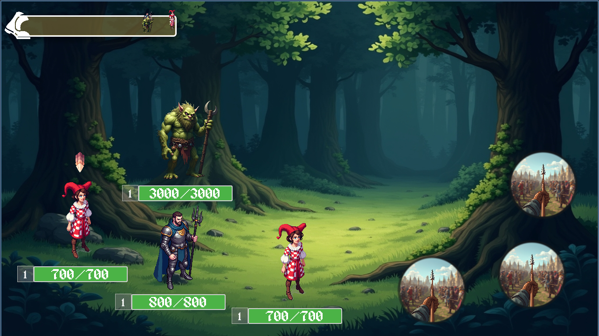
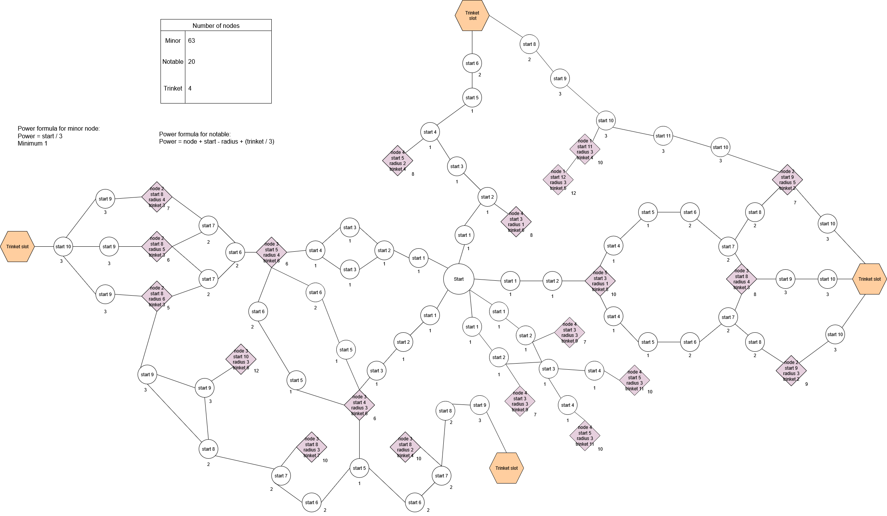

### Pensho Champ Collector

[Design document](https://docs.google.com/document/d/1ns36_C5YVovsMCLkixQRpSMNiDWo7jLsMu4hmxHXA1Q/edit?usp=sharing)

[Character definitions](https://docs.google.com/spreadsheets/d/1n8UZatjqf0H1tQHVMttEpeotQxDmV__Ra6wW-4EHMIQ/edit?usp=sharing)

[Backlog](https://docs.google.com/spreadsheets/d/1vBTBvbYLaBTUz-RKrKJq39-S72VJVmBdY5KVC8Eosn4/edit?usp=sharing)

[Backlog in Teamhood](https://pensho.teamhood.com/PEWO/Board/CHCO?view=KANB)

## Visual examples of the project

State of battle (2025_09_19)

Plan of potential talent tree for characters.

