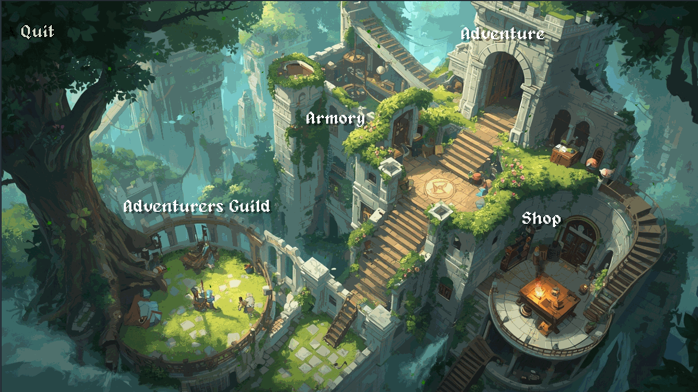

## Pensho Champ Collector

[Design document](https://docs.google.com/document/d/1ns36_C5YVovsMCLkixQRpSMNiDWo7jLsMu4hmxHXA1Q/edit?usp=sharing)

[Character definitions](https://docs.google.com/spreadsheets/d/1n8UZatjqf0H1tQHVMttEpeotQxDmV__Ra6wW-4EHMIQ/edit?usp=sharing)

[Backlog](https://github.com/users/Pensho/projects/1)

### Visual examples of the project

Example of city (31-01-2026)

State of battle (15-09-2025)

Plan of potential talent tree for characters.

